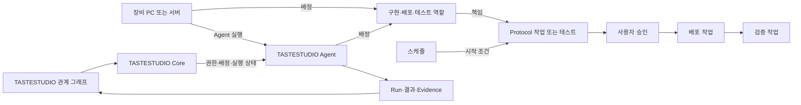

# TASTEDEV Studio 비전 및 기준 아키텍처

## 문서 기준

- 기준일: 2026-09-29, STEP 0.
- 사용자 추가 지시: **신규 프로젝트 작업**. 최초 요청의 기존 프로젝트 분석 전제는 빈 신규 저장소 조사로 대체한다.
- 공식 제품명: **TASTEDEV Studio**.
- 이 문서는 목표 설계다. 현재 구현 여부는 [현재 분석](TASTEDEV_CURRENT_ANALYSIS.md), 격차는 [GAP 분석](TASTEDEV_GAP_ANALYSIS.md), 단계별 실행 기준은 [로드맵](TASTEDEV_IMPLEMENTATION_ROADMAP.md)을 따른다.

## 제품 정의와 핵심 목표

TASTESTUDIO는 프로젝트의 장비·Agent·역할·작업·승인·스케줄 관계를 구성하고 실제 실행을 조율하는 오케스트레이션 시스템이다. 사용자는 관계 그래프에서 구현·빌드·배포·테스트 흐름을 정의하고 실행 상태와 결과를 확인한다. 파일 편집·터미널·Git·AI 분석은 선택한 작업을 수행하고 검증하는 보조 도구다.

사용자 Workflow:

`Project → Device / Agent / Role → Task / Approval / Schedule → Core validation → Queue / Dispatch → Execution → Result / Evidence → Analysis / Fix / Retest`

장비는 실행 환경이 있는 PC 또는 서버이고 Agent는 그 장비에서 실제 작업을 수행하는 실행자다. 역할은 구현·배포·테스트의 책임이며 장비 자체의 종류가 아니다. 한 장비가 여러 역할을 담당하거나 여러 Agent를 실행할 수 있다. 그래프의 장비 노드와 Agent의 연결 관계는 명시적으로 선언하며 Agent 이름으로 소속 장비를 추측하지 않는다. 선언된 관계와 실제 연결·실행 가능 상태도 구분한다.



그래프는 구성·의도를 표현하고 Core는 저장된 정의, 권한, Agent capability와 실행 입력을 검증한다. 노드 연결이나 구성 저장만으로 작업이 실행됐거나 성공했다고 표시하지 않는다. 배포 및 Source 변경은 각 승인 정책을 유지한다. 구현 장비·배포 장비·테스트 장비에 대한 실제 설치/외부 검증은 로컬 코드 검증과 별도 근거로 기록한다.

장기적으로 로컬 개발과 원격 실행의 결과를 같은 Project 문맥에서 추적한다. 기능별 진행 상태와 실패 원인, 실행 환경, 소스 revision, 증거를 연결하여 재현 가능한 개발 흐름을 제공한다.

## Project-Centric 원칙

- **Project = WHAT**: 무엇을 편집·빌드·실행·검증할지 정의한다.
- **Agent = HOW / WHERE**: 요구 capability와 환경을 만족하는 장비에서 실행한다.
- **Core = WHO / WHEN / STATE**: 요청 권한, 선택·배정, 큐, 상태와 결과를 관리한다.
- **Studio = GUI / Developer Experience**: 사용자 의도와 상태·결과를 표현한다.

목표 실행 관계:

`Project → TASTEDEV Protocol → TASTESTUDIO Core → Job → Agent Selection → Execution → Result`

Project는 특정 Agent에 종속되지 않으며 Agent도 특정 Project에 종속되지 않는다. Agent에 `if project == "tastefiles"`, `buildeon`, `easysurvey` 같은 이름별 실행 분기를 두지 않는다. Project별 차이는 선언형 task, 환경, capability 요구 및 입력으로 표현한다. 로컬 실행 역시 같은 실행 계약을 따르도록 발전시킨다.

## 네 영역의 책임

| 영역 | 담당 | 경계 |
|---|---|---|
| Studio | Project Manager, Workspace, File Explorer, Code Editor, Search, Terminal, Git, Build, Run, Tests, Agents, Problems, Logs, Issues, AI Assistant, Settings | 화면에서 직접 큐·원격 실행 상태의 별도 원본을 만들지 않는다. 호스트 파일 접근은 adapter를 통해 수행한다. |
| Core | Project metadata, Agent Registry, Job, Queue, Dispatch, Run, RunStep, Environment, Artifact, Result, Scheduler, Events | 권한과 실행 상태의 권위 있는 원본. 요청 수락과 실제 실행 성공을 구분한다. |
| Agent | register, heartbeat, capability report, receive job, prepare workspace, command/build/run/test/browser test, stream logs, collect evidence, upload artifacts, report result | 범용 Rust 실행자. 작업 지시를 실행하고 관찰 결과를 보고하며 제품명을 해석하지 않는다. |
| Protocol | Project와 실행 계층 사이의 버전 있는 선언·검증 규격 | `.tastedev/project.yml`, `environments.yml`, `tasks.yml`, `tests.yml`을 후보로 검토한다. STEP 0에서 schema/parser를 만들지 않는다. |

Core의 Job은 실행 요청, Run은 개별 실행 시도, RunStep은 실행 내 단계로 구분한다. 재시도는 이전 시도와 증거를 보존한다. 정확한 상태 전이·lease·이벤트 순서 계약은 해당 구현 단계 전에 확정한다.

## Project 저장 방식

기본 구조는 **Workspace Storage + Git + Database Metadata**다. 소스 파일 본문을 DB에 저장하지 않는다.

```text
workspace/
  tastefiles/
  buildeon/
  easysurvey/
```

위 이름은 사용 예시이며 현재 존재하는 Studio 프로젝트가 아니다. DB metadata 후보는 `id`, `name`, `description`, `workspacePath`, `repositoryUrl`, `defaultBranch`, `framework`, `runtime`, `createdAt`, `updatedAt`, `lastOpenedAt`이다. `workspacePath`는 호스트별 위치이므로 원격 Agent에 로컬 절대 경로를 그대로 전달하지 않는다. 원격 workspace는 repository revision 또는 명시된 source snapshot으로 준비하고 호스트별 매핑을 관리한다. 로그·artifact·evidence 본체의 저장소와 DB 인덱스도 구분한다.

## 목표 GUI

Project를 열면 `Activity Bar + Sidebar + Editor + AI Panel + Bottom Panel + Status Bar`로 구성된 Workspace를 제공한다.

- Activity Bar: Project, Explorer, Search, Git, Run, Tests, Agents, Issues, AI, Settings.
- Sidebar: 선택한 활동의 탐색기·목록·검색 결과.
- Editor: 문서 탭, dirty 상태, 저장 충돌과 편집 위치.
- AI Panel: Project 문맥, 제안, 변경 diff와 사용자 적용 동작.
- Bottom Panel: Terminal, Output, Problems, Tests, Agent, Logs.
- Status Bar: 현재 Project, branch, 실행 환경, Agent 연결, 작업 상태.

현재 UI 코드는 없으므로 결합할 기존 layout도 없다. 향후 Shell에서 패널 상태와 Project 상태를 분리하고, Editor·Terminal의 수명과 활성 Project 변경을 명시적으로 관리한다. 좁은 창에서는 보조 패널을 접을 수 있게 하되 편집 상태를 보존한다. STEP 0에는 GUI 구현·시안 생성이 포함되지 않는다.

## 기술 후보와 결정 범위

| 영역 | 후보 | 이 저장소 기준 평가 / 확정 전 확인 |
|---|---|---|
| Studio | Tauri 2, Next.js, React, TypeScript | 설치·채택되지 않았다. 로컬 filesystem/PTY를 위해 desktop host가 필요하다. Next.js 서버 기능과 Tauri 정적 프런트엔드 경계를 먼저 실험·확정한다. |
| IDE | Monaco Editor, xterm.js | 각각 코드 편집과 터미널 표시 후보. 파일 저장·PTY 실행 backend를 대신하지 않는다. |
| UI | Tailwind CSS, HeroUI | 재사용할 현재 UI가 없어 신규 선택 대상이다. 접근성, theme, desktop bundle 적합성 평가 후 선택한다. |
| Core | TypeScript, PostgreSQL, REST/API, WebSocket 또는 Event Stream | 메타데이터·상태 영속성과 이벤트 전달 후보. 양방향 터미널과 단방향 로그 요구를 구분한다. |
| Agent | Rust | 범용 OS 실행·취소·프로세스 수명 관리 후보. Project 이름에 의존하지 않는다. |
| Test | Playwright + Project 자체 테스트 도구 | browser 검증과 command 결과 수집을 연결한다. browser 자동화가 native desktop 전체 검증을 대체하지 않는다. |
| AI | Provider abstraction | 모델·도구 capability, 취소, streaming, 오류를 공통 계약으로 감싼다. 특정 SDK 타입이 핵심 도메인에 스며들지 않게 한다. |

버전별 호환성·라이선스·번들 크기·성능은 아직 검증하지 않았다. 현재 설치된 기술인 것처럼 해석하지 않는다. 패키지 설치·기술 PoC·DB 생성은 후속 단계의 승인 범위다.

## 기존 기능 보호 및 장기 목표

현재 보호할 제품 코드가 없지만 이후 도입되는 기능은 단계별 회귀 기준을 유지한다. 다른 TASTEDEV 제품의 소스를 승인 없이 복사·이동·통합하지 않는다. AI 수정은 diff 검토, 적용 범위 제한, 복구 가능한 변경, 테스트 및 재테스트 기록을 갖춘다. Issue 게시와 Scheduler 활성화는 명시된 사용자 동작·정책 아래 수행한다.

장기 목표는 Project 중심 IDE, 로컬·원격 공통 실행 계약, 증거 기반 결과 탐색, 공급자 독립 AI 지원, 실패 수정 및 반복 검증이다. 현재 STEP 0 완료는 이 기능들의 구현 완료를 의미하지 않는다.
